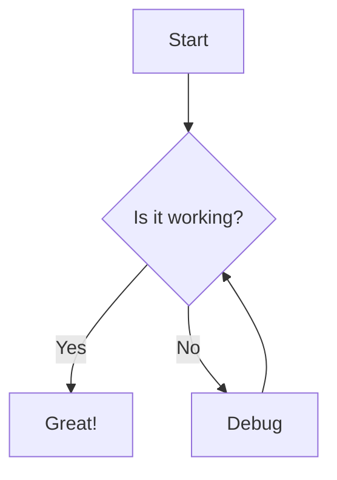
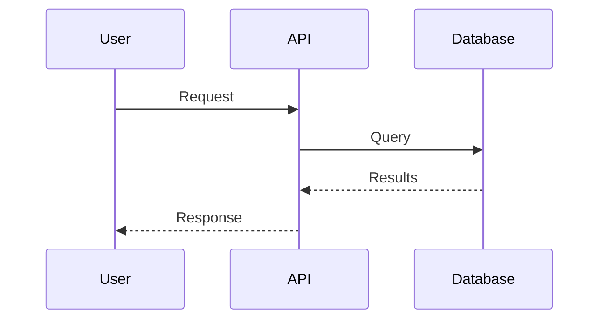

# Repository README Analysis Summary

Analysis of all 20 repository READMEs against best practices.

## Scores by Repository

| Repository | Score | Rating | Essential | Important | Nice-to-Have |
|------------|-------|--------|-----------|-----------|--------------|
| rustfs | 67/100 | Fair ⭐ | 6/6 | 1/5 | - |
| fab-swarm | 57/100 | Needs Improvement | 5/6 | 1/5 | - |
| *More analyses pending...* | | | | | |

## Best Practices Checked

### Essential Sections (50 points)
- Title (10 pts)
- Description (10 pts)
- Installation (10 pts)
- Usage (10 pts)
- License (5 pts)
- Badges (5 pts)

### Important Sections (30 points)
- Prerequisites (6 pts)
- Configuration (6 pts)
- Contributing (6 pts)
- Changelog (6 pts)
- Authors (6 pts)

### Nice-to-Have Sections (15 points)
- Table of Contents (3 pts)
- Screenshots (3 pts)
- Features (3 pts)
- Roadmap (3 pts)
- FAQ (3 pts)
- Diagrams (3 pts) - Architecture, flowcharts, data models

### Quality Checks (5 points)
- Code blocks with syntax highlighting
- Working links
- Reasonable length
- Proper formatting
- **Diagrams in Mermaid format** (when diagrams are present)

## How to Use This Skill

```bash
# Analyze a specific README
node .claude/skills/readme-analyzer/readme-analyzer.js path/to/README.md

# Get just the score
node .claude/skills/readme-analyzer/readme-analyzer.js --score

# Verbose output with all sections
node .claude/skills/readme-analyzer/readme-analyzer.js --verbose
```

## Common Missing Sections

Based on initial analysis:
- **Prerequisites** - Often missing, should be added before Installation
- **Changelog** - Important for tracking changes
- **Configuration** - How to customize/setup the project
- **Authors/Maintainers** - Who maintains this project
- **Diagrams** - Architecture diagrams, flowcharts, and data models help users understand the system

## Diagram Standards

**✅ REQUIRED FORMAT:** All diagrams MUST be created using **Mermaid** syntax.

**Why Mermaid?**
- Text-based (version control friendly)
- Renders natively on GitHub, GitLab, and many markdown editors
- No external tools or image files needed
- Easy to update and maintain
- Supports: flowcharts, sequence diagrams, entity-relationship diagrams, gantt charts, and more

**Mermaid Examples:**





**❌ AVOID:**
- Image files (PNG, JPG) - not version-control friendly
- External diagramming tools (draw.io, lucidchart) - creates external dependencies
- ASCII art - hard to read and maintain

**✅ GOOD PRACTICE:**
- Include Mermaid diagrams directly in README.md
- Keep diagrams simple and focused
- Add brief descriptions before each diagram
- Use consistent styling across all diagrams

## Recommendations

1. **High Priority**: Add missing Essential sections
2. **Medium Priority**: Add at least 3 Important sections
3. **Low Priority**: Enhance with Nice-to-Have sections

Generated by README Analyzer Skill
