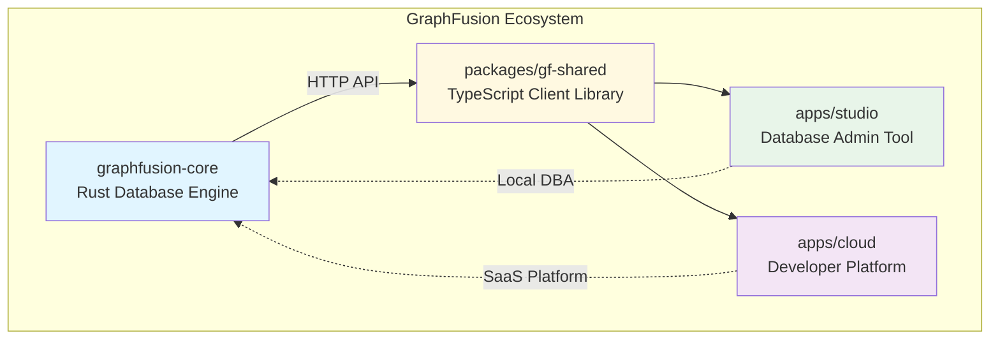

# GraphFusion

High-performance graph query engine for code intelligence, M&A due diligence, and technical debt analysis. Native Rust implementation with Arrow columnar storage and graph-native algorithms.

## 🏗️ Architecture

GraphFusion consists of three main components:



### Components

- **[graphfusion-core](crates/)** - High-performance Rust database engine (OSS)
- **[packages/gf-shared](packages/gf-shared/)** - Shared TypeScript client and types
- **[apps/studio](apps/studio/)** - Lightweight database admin tool (no auth/billing)
- **[apps/cloud](apps/cloud/)** - Full SaaS platform with OAuth2 + Stripe

## 🚀 Quick Start

### Option 1: Database Admin Tool (Studio)

For local development and database administration:

```bash
# Install Deno
curl -fsSL https://deno.land/install.sh | sh

# Start Studio
cd apps/studio
cp .env.example .env
deno task start

# Open http://localhost:8000
```

**Features:** Query editor, sample queries, graph visualization, no authentication needed.

### Option 2: SaaS Platform (Cloud)

For multi-tenant production deployments with billing:

```bash
# Configure OAuth + Stripe
cd apps/cloud
cp .env.example .env
# Edit .env with your credentials

deno task start

# Open http://localhost:8001
```

**Features:** Organizations, team management, OAuth2, Stripe billing, API keys, project management.

**See [MIGRATION_GUIDE.md](docs/MIGRATION_GUIDE.md) if migrating from graphfusion-admin.**

## 📊 Key Differentiators

GraphFusion implements 10+ state-of-the-art optimizations that set it apart from traditional graph databases:

| Feature | Benefit | Benchmark |
|---------|---------|-----------|
| **Columnar + CSR** | Hybrid Arrow + compressed sparse row | 10.89x offset compression |
| **FSST Compression** | Fast string compression for code | 3.3-5.4x size reduction |
| **BMI2 Acceleration** | Hardware bit manipulation | 22.8x speedup |
| **FastLanes Bitpacking** | Transposed integer encoding | 3.16x compression |
| **Factorized Joins** | Late materialization | Reduced intermediate results |
| **WCOJ Leapfrog** | Worst-case optimal joins | 43K triangles in <10ms |
| **SIMD Dispatch** | AVX2/SSE auto-detection | Vectorized operations |
| **Semi-Masking** | Bloom filter pruning | 2.94x join speedup |
| **Path Semantics** | WALK/TRAIL constraints | Acyclic path queries |
| **Vectorized Eval** | Arrow-native expressions | 3-5x filter speedup |
| **Hybrid Search** | BM25 + vector + graph fusion | 52 µs for 1K nodes |
| **Property Indexing** | Full-text search on all properties | 35K nodes/sec indexing |

### Compression Comparison

```
Standard CSR:     8 bytes/edge (64 bits)
Elias-Fano:       0.7 bytes/edge (5.9 bits) → 10.89x compression
WebGraph:         3.2 bytes/edge (25 bits)  → 2.5x compression
FSST Strings:     3.3-5.4x compression on code identifiers
```

## 📁 Project Structure

```
GraphFusion/
├── Cargo.toml                    # Rust workspace root
├── crates/
│   ├── graphfusion-core/         # Core database engine (Rust)
│   │   └── src/
│   │       ├── graph/            # CSR, node/edge types
│   │       ├── storage/          # Lance persistence
│   │       ├── operators/        # Graph operators (BFS, PageRank, WCOJ)
│   │       └── query/            # Query planning
│   ├── graphfusion-parser/       # Cypher parser
│   │   └── src/
│   │       ├── ast.rs            # AST definitions
│   │       ├── lexer.rs          # Logos-based lexer
│   │       └── parser.rs         # Recursive descent
│   ├── graphfusion-node/         # Node.js bindings
│   ├── graphfusion-cli/          # CLI tool
│   └── graphfusion-flight/       # Arrow Flight RPC server
├── packages/
│   └── gf-shared/                # Shared TypeScript library
│       ├── lib/
│       │   ├── types.ts          # Core types
│       │   └── client.ts         # GraphFusionClient
│       └── mod.ts                # Entry point
└── apps/
    ├── studio/                   # Database admin tool
    │   ├── routes/
    │   │   ├── index.tsx         # Query editor page
    │   │   └── api/query.ts      # Query API endpoint
    │   ├── islands/
    │   │   └── QueryEditor.tsx   # Interactive editor
    │   └── lib/graphfusion.ts    # Client wrapper
    └── cloud/                    # SaaS platform
        ├── routes/
        │   ├── login.tsx         # Login page
        │   ├── dashboard.tsx     # Dashboard
        │   └── organizations/    # Org management
        ├── lib/
        │   ├── auth.ts           # OAuth2 implementation
        │   ├── organizations.ts  # Org management
        │   ├── projects.ts       # Project management
        │   ├── billing.ts        # Stripe integration
        │   └── api-keys.ts       # API key management
        └── fresh.config.ts       # Fresh framework config
```

## Features

### Graph Operators

- **GraphScanExec**: Efficient node/edge scanning with predicate pushdown
- **ExpandExec**: Variable-length path expansion (BFS/DFS)
- **ShortestPathExec**: Unweighted shortest path computation

### Cypher Support

```cypher
-- Find all functions in a file
MATCH (f:File {name: "main.rs"})-[:CONTAINS]->(fn:Function)
RETURN fn.name

-- Call hierarchy (up to 5 hops)
MATCH (f:Function {name: "process"})-[:CALLS*1..5]->(called:Function)
RETURN f.name AS caller, called.name AS callee

-- Find blast radius
MATCH (f:Function {name: "core_logic"})<-[:CALLS*1..3]-(caller:Function)
RETURN DISTINCT caller.name AS affected
```

### Node Types

- Structure: `Repository`, `Package`, `Module`, `File`
- Code: `Function`, `Method`, `Class`, `Struct`, `Interface`, `Trait`, `Enum`
- Variables: `Variable`, `Parameter`
- Control Flow: `BasicBlock`, `Statement`, `Expression`
- Temporal: `Commit`, `Author`

### Edge Types

- Structural: `Contains`, `BelongsTo`
- Dependencies: `Imports`, `Exports`, `Calls`, `References`
- Type: `Inherits`, `Implements`, `TypeOf`
- Control Flow: `ControlFlow`, `Dominates`, `PostDominates`
- Data Flow: `DataFlow`, `Defines`, `Uses`
- Temporal: `Modifies`, `AuthoredBy`, `CoChangedWith`

## 💻 Usage Examples

### Rust CLI

```bash
# Build the database engine
cargo build --release

# Initialize database
./target/release/graphfusion init

# Add nodes
./target/release/graphfusion add-node -t File -n "main.rs"
./target/release/graphfusion add-node -t Function -n "main"

# Add edge
./target/release/graphfusion add-edge -s 0 -T 1 -e CONTAINS

# Query
./target/release/graphfusion query "MATCH (n:File) RETURN n.name"

# Interactive REPL
./target/release/graphfusion repl
```

### TypeScript Client (Studio/Cloud)

```typescript
import { GraphFusionClient } from "@graphfusion/shared/client";
import type { QueryResult } from "@graphfusion/shared/types";

// Create client
const client = new GraphFusionClient({
  baseUrl: "http://localhost:8080",
  timeout: 30000,
  retries: 3,
});

// Execute Cypher query
const result: QueryResult = await client.query(
  "MATCH (n:Function) RETURN n.name LIMIT 10"
);

console.log(`Found ${result.rowCount} functions`);
console.log(`Execution time: ${result.executionTimeMs}ms`);

// Get database statistics
const stats = await client.getStats();
console.log(`Nodes: ${stats.nodeCount}, Edges: ${stats.edgeCount}`);

// Sample graph for visualization
const graph = await client.sampleGraph(100);
```

### Studio Query Editor

```cypher
-- Find all functions in a file
MATCH (f:File {name: "main.rs"})-[:CONTAINS]->(fn:Function)
RETURN fn.name

-- Call hierarchy (up to 5 hops)
MATCH (f:Function {name: "process"})-[:CALLS*1..5]->(called:Function)
RETURN f.name AS caller, called.name AS callee

-- Find blast radius
MATCH (f:Function {name: "core_logic"})<-[:CALLS*1..3]-(caller:Function)
RETURN DISTINCT caller.name AS affected
```

### Cloud API Access

```typescript
// Using API keys for programmatic access
const response = await fetch("https://api.graphfusion.io/query", {
  method: "POST",
  headers: {
    "Content-Type": "application/json",
    "X-API-Key": "gf_your_api_key_here",
  },
  body: JSON.stringify({
    query: "MATCH (n) RETURN count(n) AS count",
    projectId: "proj_abc123",
  }),
});

const result = await response.json();
```

## Use Cases

- **Code Intelligence**: Map source code structure for AI agents
- **Technical Debt**: Measure complexity, coupling, cohesion
- **M&A Due Diligence**: Analyze codebase health, dependencies
- **Blast Radius**: Understand change impact
- **Co-change Analysis**: Find files that change together

## 🛠️ Development

### Local Testing (GitHub CI Disabled)

GitHub Actions CI has been disabled to avoid tier costs. Use local testing scripts instead:

```bash
# Run all tests before committing (recommended)
./scripts/test-local.sh

# Run performance benchmarks
./scripts/benchmark-local.sh

# See scripts/README.md for details
```

### Rust Core Engine

```bash
# Build all crates
cargo build

# Run tests (use nextest for better performance)
cargo nextest run

# Run specific crate tests
cargo nextest run -p graphfusion-parser

# Lint
cargo clippy -- -D warnings

# Format
cargo fmt

# Documentation
cargo doc --open
```

### TypeScript Apps

```bash
# Studio (Database Admin)
cd apps/studio
deno task check      # Type check
deno task start      # Dev server with hot reload
deno task build      # Production build

# Cloud (SaaS Platform)
cd apps/cloud
deno task check      # Type check
deno task start      # Dev server
deno task test       # Run tests

# Shared Package
cd packages/gf-shared
deno task check      # Type check
deno task test       # Run tests
```

### Running Tests

```bash
# Rust: Use nextest (faster, better output)
cargo nextest run

# TypeScript: Studio + Cloud
cd apps/studio && deno task test
cd apps/cloud && deno task test

# Integration tests
deno test --allow-all tests/
```

## 🗺️ Roadmap

### Completed ✅

**Core Engine:**
- [x] WCOJ (Worst-Case Optimal Join) for cyclic queries
- [x] SIMD runtime dispatcher (AVX2/SSE)
- [x] Elias-Fano compression for CSR offsets
- [x] FSST string compression
- [x] BMI2 hardware acceleration
- [x] Property-based testing (proptest)
- [x] WebGraph compression (basic)

**Applications:**
- [x] Studio - Database admin tool
- [x] Cloud - SaaS platform with OAuth2 + Stripe
- [x] Shared TypeScript client library
- [x] API key management for programmatic access

### In Progress 🔄
- [ ] WebGraph reference compression (2-4 bits/edge)
- [ ] Lance persistence implementation
- [ ] HTTP/WebSocket/SSE server

### Planned 📋

**Core Engine:**
- [ ] Incremental graph updates (differential dataflow)
- [ ] GPU acceleration (CubeCL for AMD/ROCm)
- [ ] Tree-sitter integration for code parsing
- [ ] Control flow graph construction
- [ ] Data flow analysis (IFDS)

**Cloud Platform:**
- [ ] Usage-based billing with Stripe metered subscriptions
- [ ] Project templates and quickstarts
- [ ] Team collaboration features (comments, annotations)
- [ ] Audit logs and compliance features
- [ ] Webhook integrations

## License

Proprietary - All Rights Reserved. See [LICENSE](LICENSE) for details.
