# Field Operations Authorization System (FOAS)

**STARION Group B.V. - Technical Demonstration**

> A distributed tactical authorization system showcasing advanced distributed systems concepts: mesh peer-to-peer networking, Conflict-free Replicated Data Types (CRDTs), post-quantum cryptography, AI agent coordination, and state-of-the-art object tracking handoff — all in a cross-platform desktop application.

---

## What Makes This Special

This isn't just another CRUD app. It solves **one of the hardest problems in distributed systems**: maintaining consistency across multiple nodes that can disconnect, reconnect, and make concurrent changes — all without a central server.

### The Challenge

Imagine military field operators who need authorization from HQ, but:
- Network connectivity is **unreliable** (satellite, radio, contested environment)
- There's **no central server** (single point of failure = mission failure)
- Multiple HQ operators might make **concurrent decisions**
- Devices can operate **offline for hours** then sync later
- Security must withstand **future quantum computers**
- Objects (drones, personnel) move between node coverage areas requiring **seamless handoff**
- AI agents must **coordinate autonomously** without central orchestration

### The Solution

A **mesh P2P network** where every node is equal, using **CRDTs** for automatic conflict resolution, secured with **hybrid post-quantum cryptography**, with **SLHPIM hybrid handoff** for object tracking and **GNN-style agent coordination**.

```mermaid
flowchart LR
    subgraph Field ["Field Operations"]
        F1["📱 Field Unit 1"]
        F2["📱 Field Unit 2"]
    end

    subgraph HQ ["Headquarters"]
        H1["🖥️ HQ Operator 1"]
        H2["🖥️ HQ Operator 2"]
    end

    F1 <-->|"Encrypted P2P<br/>CRDT Sync"| H1
    F1 <-->|"Encrypted P2P<br/>CRDT Sync"| H2
    F2 <-->|"Encrypted P2P<br/>CRDT Sync"| H1
    F2 <-->|"Encrypted P2P<br/>CRDT Sync"| H2
    F1 <-->|"Encrypted P2P"| F2
    H1 <-->|"Encrypted P2P"| H2

    style F1 fill:#ff9800,color:#fff
    style F2 fill:#ff9800,color:#fff
    style H1 fill:#4caf50,color:#fff
    style H2 fill:#4caf50,color:#fff
```



---

## Key Technical Achievements

### 1. Custom CRDT Implementation

I implemented four CRDT types from scratch (no libraries):

```mermaid
flowchart TB
    subgraph CRDTs ["Conflict-Free Replicated Data Types"]
        HLC["🕐 Hybrid Logical Clock (HLC)<br/>Provides global ordering across all nodes<br/>even with clock skew"]
        LWW["📝 LWW-Register&lt;T&gt;<br/>Last-Writer-Wins semantics<br/>Higher timestamp wins"]
        MAP["📖 LWW-Map&lt;K,V&gt;<br/>Dictionary where each key has<br/>its own LWW-Register"]
        SET["📋 OR-Set&lt;T&gt;<br/>Observed-Remove Set<br/>Handles add-remove-add scenarios"]
    end

    HLC --> LWW
    LWW --> MAP
    MAP --> SET

    style HLC fill:#e1f5fe
    style LWW fill:#e8f5e9
    style MAP fill:#fff3e0
    style SET fill:#fce4ec
```



**Why it matters**: CRDTs guarantee that all nodes **eventually converge** to the same state, regardless of the order messages arrive. No consensus protocol needed, no leader election, no distributed locks.

### 2. Mesh P2P Networking

```mermaid
graph TB
    subgraph Mesh ["Peer-to-Peer Mesh Network"]
        A["🖥️ Node A<br/>(HQ)"]
        B["🖥️ Node B<br/>(Field)"]
        C["🖥️ Node C<br/>(Field)"]
        D["🖥️ Node D<br/>(Field)"]
        E["🖥️ Node E<br/>(Field)"]
    end

    A <--> B
    A <--> C
    A <--> D
    A <--> E
    B <--> C
    B <--> D
    B <--> E
    C <--> D
    C <--> E
    D <--> E

    style A fill:#4caf50,color:#fff
    style B fill:#2196f3,color:#fff
    style C fill:#2196f3,color:#fff
    style D fill:#2196f3,color:#fff
    style E fill:#2196f3,color:#fff
```



**Every node connects to every other node. No central server. No single point of failure.**

**Features**:
- **UDP Broadcast Discovery**: Nodes automatically find each other on the local network
- **TCP Persistent Connections**: Reliable message delivery between peers
- **Delta Synchronization**: Only send changes since last sync (bandwidth efficient)
- **Automatic Reconnection**: Handles network partitions gracefully

### 3. Post-Quantum Cryptography

Future quantum computers could break RSA and ECDH. This system uses **hybrid encryption**:

```mermaid
flowchart TB
    subgraph Hybrid ["Hybrid Cryptography - Must Break BOTH"]
        subgraph Classical ["🔐 Classical (Today's Security)"]
            ECDH["ECDH P-384<br/>Key Exchange"]
            ECDSA["ECDSA P-384<br/>Signatures"]
        end

        subgraph PostQuantum ["🛡️ Post-Quantum (Future Security)"]
            MLKEM["ML-KEM-768<br/>(Kyber)"]
            MLDSA["ML-DSA-65<br/>(Dilithium)"]
        end

        AES["AES-256-GCM<br/>Symmetric Encryption"]
    end

    ECDH --> AES
    MLKEM --> AES
    ECDSA --> MSG["✉️ Signed Message"]
    MLDSA --> MSG

    style Classical fill:#e3f2fd
    style PostQuantum fill:#e8f5e9
    style AES fill:#fff3e0
```



| Layer | Classical | Post-Quantum |
|-------|-----------|--------------|
| Key Exchange | ECDH P-384 | **ML-KEM-768** (Kyber) |
| Signatures | ECDSA P-384 | **ML-DSA-65** (Dilithium) |
| Encryption | AES-256-GCM | - |

**How hybrid works**: Both algorithms run in parallel. An attacker must break **both** to compromise the system. Today's computers can't break ECDH; future quantum computers can't break ML-KEM.

### 4. Compile-Time Dependency Injection Verification

```csharp
// Settings validated at build time, not runtime
services.AddFieldOps(configuration);

// All service dependencies verified before app starts
services.BuildServiceProvider(new ServiceProviderOptions
{
    ValidateOnBuild = true,   // Fail if any dependency missing
    ValidateScopes = true     // Fail if scoped services misused
});
```

**Why it matters**: Configuration errors caught during development, not in production.

### 5. Whisper Mesh Protocol (TRIZ-Inspired)

Novel gossip-based communication using inventive problem-solving principles:

```mermaid
flowchart TB
    subgraph WhisperMesh ["🔊 Whisper Mesh Protocol"]
        WP["WhisperProtocol<br/>Fragment-based state propagation"]
        MD["MurmurDiscovery<br/>Gossip-based peer discovery"]
        WDA["WhisperDeltaAdapter<br/>CRDT integration + vector clocks"]
        WM["WhisperMesh<br/>Self-organizing mesh network"]
    end

    WP --> MD
    MD --> WDA
    WDA --> WM

    style WP fill:#e1f5fe
    style MD fill:#e8f5e9
    style WDA fill:#fff3e0
    style WM fill:#fce4ec
```



**Key innovations**:
- **Murmurs, not broadcasts**: Peers discover each other through gossip (epidemic spreading)
- **Bloom filter presence fields**: Efficient membership tracking
- **Resonance patterns**: Amplify important messages, dampen noise
- **Phase transitions**: Quiet → Chorus based on network activity

### 6. Object Tracking Handoff (SLHPIM)

State-of-the-art **Spatial Lease Handoff with Predictive Interest Management** — a novel hybrid pattern synthesizing:

| Source | Mechanism Borrowed |
|--------|-------------------|
| **5G CHO** | Predictive triggers, L3 filtering, hysteresis |
| **SpatialOS** | Spatial authority zones, interest management |
| **CockroachDB** | Epoch-based leases, fencing tokens |
| **CRDT** | HLC merge semantics for partition tolerance |
| **Gossip** | k-witness quorum for Byzantine resistance |

```
┌─────────────────────────────────────────────────────────────────┐
│                         SLHPIM Handoff                           │
├─────────────────────────────────────────────────────────────────┤
│                                                                  │
│   Node A (tracking)          Object moves →         Node B       │
│        │                                               │         │
│   1. Signal degrades ──────────────────────────────►  │         │
│   2. Velocity prediction triggers handoff              │         │
│   3. Prepare multi-target ─────────────────────────►  │         │
│   4. k-witness quorum validates                       │         │
│   5. Epoch-based lease transfer ───────────────────► │         │
│   6. Fencing token prevents stale writes              │         │
│        │                                          OWNER         │
│                                                                  │
│   Latency: 300-500ms | Continuity: 99.9% | Ping-pong: <1%       │
└─────────────────────────────────────────────────────────────────┘
```

**Usage**:
```csharp
// SLHPIM is the default (hybrid pattern)
var handoff = HandoffManagerFactory.Create(nodeId);

// Or explicitly select pattern
var handoff = HandoffManagerFactory.Create(nodeId, HandoffPattern.Slhpim);
var handoff = HandoffManagerFactory.Create(nodeId, HandoffPattern.SignalBased);
```

### 7. Distributed Agent Coordination (GNN-Style)

Novel Claude agent coordination using distributed graph neural network concepts:


**Key innovations**:
- **No central coordinator**: Graph structure stored in CRDTs
- **Edges emerge from interactions**: Stronger connections = more collaboration
- **Attention-weighted aggregation**: Like Graph Attention Networks (GAT)
- **Capability-based routing**: Find best agent for task via cosine similarity

### 8. High-Performance Optimizations

SIMD and lock-free structures for hot path performance:

| Optimization | Target | Implementation |
|--------------|--------|----------------|
| **Cosine Similarity** | <100ns (128-dim) | AVX/SSE intrinsics |
| **GNN Aggregation** | Zero allocations | Pre-allocated buffers |
| **Counter Increment** | ~1ns | Distributed atomic counters |
| **Object Pooling** | Thread-local | Lock-free pool with caching |

```csharp
// SIMD-optimized vector operations
var similarity = SimdVectorOps.CosineSimilarity(embedding1, embedding2);

// Lock-free statistics (no contention)
var stats = new LockFreeStats();
stats.Record(latencyNs);  // ~1ns per call

// Object pooling for zero-allocation hot paths
using var matches = graph.FindAgentsForTask(task);  // Pooled results
```

### 9. Distributed Time Synchronization

Hybrid Logical Clock with peer synchronization:

```
┌─────────────────────────────────────────────────────────────────┐
│                    Time Synchronization                          │
├─────────────────────────────────────────────────────────────────┤
│                                                                  │
│   HLC = (PhysicalTime, LogicalCounter)                          │
│                                                                  │
│   • Monotonically increasing (never goes backwards)              │
│   • Captures causality (if A→B, then HLC(A) < HLC(B))           │
│   • Bounded drift from wall clock                                │
│   • Packed 64-bit for efficient transmission                     │
│                                                                  │
│   + ClockSynchronizer (NTP-style offset estimation)              │
│   + TrueTime intervals (like Google Spanner)                     │
│   + WaitUntilPast for causal consistency                         │
│                                                                  │
└─────────────────────────────────────────────────────────────────┘
```

### 10. OpenTelemetry Integration

Full observability with nanosecond-precision metrics:

```csharp
// Automatic instrumentation
var telemetry = new AgentTelemetry(coordinator);

// Metrics recorded:
// - agent.tasks.submitted (counter)
// - agent.task.routing.duration_ns (histogram)
// - agent.gnn.aggregation.duration_ns (histogram)
// - agent.graph.nodes.count (gauge)

// Distributed tracing
using var activity = telemetry.StartTimed("task.route");
// ... operation ...
// Automatically records duration in nanoseconds
```

---

## Glossary of Terms

Quick reference for all technical terms used in this project:

| Term | Full Name | What It Does |
|------|-----------|--------------|
| **CRDT** | Conflict-free Replicated Data Type | Data structure that can be modified on multiple nodes independently and merged without conflicts |
| **HLC** | Hybrid Logical Clock | Timestamp combining wall-clock time + counter + node ID for global ordering |
| **LWW** | Last-Writer-Wins | Conflict resolution: the most recent update (by timestamp) wins |
| **LWW-Register** | Last-Writer-Wins Register | Single-value container using LWW semantics |
| **LWW-Map** | Last-Writer-Wins Map | Key-value dictionary where each key has its own LWW-Register |
| **OR-Set** | Observed-Remove Set | Set that supports add/remove operations with proper conflict handling |
| **Vector Clock** | - | Map of {NodeId → Counter} tracking causality between events |
| **Delta Sync** | Delta Synchronization | Sending only changes since last sync instead of full state |
| **P2P** | Peer-to-Peer | Network where nodes connect directly without a central server |
| **Mesh Network** | - | Topology where every node connects to every other node |
| **ML-KEM** | Module-Lattice Key Encapsulation | Post-quantum key exchange algorithm (formerly Kyber) |
| **ML-DSA** | Module-Lattice Digital Signature | Post-quantum signature algorithm (formerly Dilithium) |
| **ECDH** | Elliptic Curve Diffie-Hellman | Classical key exchange algorithm |
| **ECDSA** | Elliptic Curve Digital Signature Algorithm | Classical signature algorithm |
| **AES-GCM** | Advanced Encryption Standard - Galois/Counter Mode | Authenticated symmetric encryption |
| **Eventual Consistency** | - | All nodes will converge to the same state, given enough time |
| **Network Partition** | - | When nodes can't communicate due to network failure |
| **CAP Theorem** | Consistency, Availability, Partition-tolerance | Trade-off theorem: can only guarantee 2 of 3 properties |
| **SLHPIM** | Spatial Lease Handoff with Predictive Interest Management | Hybrid handoff pattern combining 5G CHO, SpatialOS, CockroachDB |
| **CHO** | Conditional Handoff | 5G technique for predictive cell handover |
| **Fencing Token** | - | Monotonic token preventing stale writes after ownership transfer |
| **k-Witness Quorum** | - | Local validation by k nearest neighbors for Byzantine resistance |
| **GNN** | Graph Neural Network | Neural network operating on graph structures via message passing |
| **SIMD** | Single Instruction Multiple Data | CPU instructions processing multiple values in parallel |
| **AVX/SSE** | Advanced Vector Extensions / Streaming SIMD Extensions | Intel/AMD SIMD instruction sets |
| **Lock-Free** | - | Concurrent data structures without mutex locks |
| **Object Pooling** | - | Reusing objects to avoid allocation overhead |
| **Gossip Protocol** | - | Epidemic information spreading between nodes |
| **Bloom Filter** | - | Probabilistic data structure for membership testing |

---

## How Authorization Works

Real-world example: Field operator requests permission for a reconnaissance mission.

```mermaid
sequenceDiagram
    participant Field as 📱 Field Operator
    participant CRDT as 🔄 WorldModel (CRDT)
    participant P2P as 🌐 P2P Network
    participant HQ as 🖥️ HQ Operator

    Field->>CRDT: Create authorization request
    Note over CRDT: LwwMap.Set(id, {status: Pending})

    CRDT->>P2P: Broadcast delta
    P2P->>HQ: Sync request arrives

    Note over HQ: Reviews request...

    HQ->>CRDT: Approve request
    Note over CRDT: LwwMap.Set(id, {status: Approved})

    CRDT->>P2P: Broadcast delta
    P2P->>Field: Sync approval arrives

    Note over Field: ✅ Authorized!<br/>Proceed with mission
```



**Even if network drops during this process**, both nodes continue operating. When reconnected, CRDTs automatically merge and both will agree on the final state.

---

## Concepts Explained

### What is a CRDT?

**Conflict-free Replicated Data Type** — a data structure that can be replicated across multiple nodes, modified independently, and merged without conflicts.

**Traditional approach** (needs coordination):
```
Node A: counter = 5
Node B: counter = 5
Both increment → A=6, B=6
Merge → counter = 6 or 7? (CONFLICT!)
```

**CRDT approach** (no coordination needed):
```
Node A: {A: 3, B: 2} → sum = 5
Node B: {A: 3, B: 2} → sum = 5
A increments: {A: 4, B: 2}
B increments: {A: 3, B: 3}
Merge: {A: 4, B: 3} → sum = 7 ✓
```

### What is a Hybrid Logical Clock?

A timestamp that combines:
1. **Physical time** (wall clock) — for human readability
2. **Logical counter** — for ordering events in the same millisecond
3. **Node ID** — for deterministic tie-breaking

```
HLC = (WallTimeMs: 1702900000000, Counter: 42, NodeId: abc123)

Comparison: First by WallTime, then Counter, then NodeId
Result: Total ordering across all events on all nodes
```

### What is Last-Writer-Wins?

A conflict resolution strategy: when two nodes update the same data, the update with the **higher timestamp wins**.

```mermaid
sequenceDiagram
    participant A as Node A
    participant B as Node B

    Note over A: T=1: Set status = "Pending"
    Note over B: T=2: Set status = "Approved"

    A->>B: Sync
    B->>A: Sync

    Note over A,B: Both compare timestamps:<br/>T=2 > T=1<br/>Result: status = "Approved" ✓
```



### What is Delta Synchronization?

Instead of sending the entire state on every sync, only send **what changed** since the last sync:


---

## Technology Stack

| Layer | Technology | Why This Choice |
|-------|------------|-----------------|
| **UI** | Avalonia 11 | Cross-platform (Linux/Windows/macOS), native performance |
| **MVVM** | CommunityToolkit.Mvvm | Source generators, minimal boilerplate |
| **State** | Custom CRDTs | No suitable library for our merge semantics |
| **Networking** | Raw TCP/UDP | Full control over protocol, no framework overhead |
| **Crypto** | BouncyCastle | Only library with ML-KEM/ML-DSA support in C# |
| **Persistence** | EF Core + SQLite | Embedded database, zero configuration |
| **Telemetry** | OpenTelemetry | Industry standard, vendor-neutral |
| **Testing** | xUnit + BenchmarkDotNet | Comprehensive unit tests + performance benchmarks |

---

## Project Structure

```
starion-poc/
├── src/
│   ├── FieldOps.Domain/          # 🎯 Core business logic
│   │   ├── Entities/             #    Authorization, Observation, UnitPosition
│   │   ├── ValueObjects/         #    GeoPosition, Classification (immutable)
│   │   ├── Events/               #    Domain events for loose coupling
│   │   └── Enums/                #    OperationType, Priority, Status
│   │
│   ├── FieldOps.Crdt/            # 🔄 Distributed state management
│   │   ├── HybridLogicalClock.cs #    Causal ordering
│   │   ├── LwwRegister.cs        #    Single-value CRDT
│   │   ├── LwwMap.cs             #    Dictionary CRDT
│   │   ├── OrSet.cs              #    Set with remove support
│   │   ├── VectorClock.cs        #    Causality tracking
│   │   └── WorldModel.cs         #    Aggregate CRDT container
│   │
│   ├── FieldOps.P2P/             # 🌐 Peer-to-peer networking
│   │   ├── Discovery/            #    UDP broadcast peer discovery
│   │   ├── Connection/           #    TCP peer connections
│   │   ├── Protocol/             #    Message types and serialization
│   │   ├── MeshNetwork.cs        #    Network orchestration
│   │   │
│   │   ├── Whisper/              # 🔊 TRIZ-inspired gossip protocol
│   │   │   ├── WhisperProtocol.cs    # Fragment-based state propagation
│   │   │   ├── MurmurDiscovery.cs    # Epidemic peer discovery
│   │   │   ├── WhisperDeltaAdapter.cs# CRDT integration
│   │   │   └── WhisperMesh.cs        # Self-organizing mesh
│   │   │
│   │   ├── Gateway/              # 📡 HQ communication
│   │   │   ├── HqLink.cs             # Backhaul abstraction
│   │   │   ├── HqGateway.cs          # Field-to-HQ bridge
│   │   │   └── StoreAndForwardBuffer.cs # Offline resilience
│   │   │
│   │   ├── Tracking/             # 🎯 Object tracking & handoff
│   │   │   ├── ObjectHandoff.cs      # Signal-based handoff
│   │   │   ├── SpatialLeaseHandoff.cs# SLHPIM hybrid pattern
│   │   │   └── IHandoffManager.cs    # Swappable implementations
│   │   │
│   │   ├── Timing/               # ⏱️ Distributed time
│   │   │   ├── HybridLogicalClock.cs # HLC for position tracking
│   │   │   └── TimeSync.cs           # Clock synchronization
│   │   │
│   │   ├── Agents/               # 🤖 AI agent coordination
│   │   │   ├── AgentGraph.cs         # Distributed GNN-style graph
│   │   │   ├── AgentCoordinator.cs   # Task routing & teams
│   │   │   ├── IAgentGraph.cs        # Graph interface
│   │   │   ├── GraphVisualizer.cs    # Multi-format visualization
│   │   │   ├── PerformanceMetrics.cs # Benchmarking
│   │   │   ├── HighResolutionTimer.cs# Nanosecond timing
│   │   │   │
│   │   │   ├── Telemetry/            # OpenTelemetry integration
│   │   │   │   ├── AgentTelemetry.cs     # Full OTel instrumentation
│   │   │   │   └── TelemetryConfiguration.cs # Semantic conventions
│   │   │   │
│   │   │   └── Optimized/            # High-performance implementations
│   │   │       ├── OptimizedAgentGraph.cs # Zero-alloc hot paths
│   │   │       ├── SimdVectorOps.cs      # AVX/SSE intrinsics
│   │   │       └── LockFreeStructures.cs # Ring buffers, pools
│   │   │
│   │   └── ... (other P2P components)
│   │
│   ├── FieldOps.Infrastructure/  # 🔧 Technical concerns
│   │   ├── Crypto/               #    Hybrid post-quantum encryption
│   │   ├── Persistence/          #    EF Core database context
│   │   ├── Telemetry/            #    OpenTelemetry instrumentation
│   │   └── Configuration/        #    Validated settings, DI setup
│   │
│   └── FieldOps.Desktop/         # 🖥️ Avalonia UI application
│       ├── Views/                #    XAML views (Map, Auth, Network)
│       ├── ViewModels/           #    MVVM view models
│       └── Program.cs            #    Entry point with DI wiring
│
├── tests/
│   ├── FieldOps.Tests/           # ✅ Unit & integration tests
│   │   ├── Crdt/                 #    CRDT correctness tests
│   │   ├── Crypto/               #    Encryption/signature tests
│   │   ├── P2P/                  #    Network integration tests
│   │   └── Personas/             #    User scenario tests
│   │
│   └── FieldOps.Benchmarks/      # ⚡ Performance benchmarks
│       ├── CrdtBenchmarks.cs     #    CRDT operation throughput
│       ├── CryptoBenchmarks.cs   #    Encryption performance
│       └── StartupBenchmarks.cs  #    Cold start timing
│
└── docs/
    ├── PRD.md                    # Product requirements
    ├── ARCHITECTURE.md           # System design deep-dive
    ├── OPERATIONAL_CONTEXT.md    # Deployment environment spec
    ├── DEMO_SCRIPT.md            # Step-by-step demo guide
    ├── HYBRID_HANDOFF_PATTERN.md # SLHPIM architecture spec
    ├── SLHPIM_INTEGRATION_GUIDE.md # Integration guide
    ├── SLHPIM_TECHNICAL_DEBATE.md # Design justifications
    ├── SLHPIM_QUICK_REFERENCE.md # One-page summary
    └── plans/                    # Implementation roadmap
```

---

## Performance Characteristics

| Operation | Typical | Target | Measured |
|-----------|---------|--------|----------|
| HLC timestamp generation | <1μs | <10μs | ✅ |
| CRDT merge (1000 entries) | <5ms | <50ms | ✅ |
| Hybrid encrypt (1KB) | <10ms | <50ms | ✅ |
| Hybrid decrypt (1KB) | <10ms | <50ms | ✅ |
| P2P message roundtrip | <50ms | <200ms | Network dependent |
| Cold start | <3s | <10s | ✅ |
| **Cosine similarity (128-dim)** | <100ns | <200ns | ✅ SIMD |
| **Object handoff (SLHPIM)** | 300-500ms | <1s | ✅ |
| **GNN aggregation** | Zero allocs | Zero allocs | ✅ Pooled |
| **Lock-free counter** | ~1ns | <10ns | ✅ |

Run benchmarks yourself:
```bash
dotnet run --project tests/FieldOps.Benchmarks -c Release
```

---

## Code Quality Measures

### Static Analysis (6 Analyzers)
- **Roslynator**: 500+ code quality rules
- **StyleCop**: Consistent code style
- **SonarAnalyzer**: Security and reliability
- **Meziantou**: .NET best practices
- **AsyncFixer**: Async/await correctness
- **SecurityCodeScan**: Vulnerability detection

### Pre-commit Hooks
```bash
# Automatically runs before every commit:
✓ dotnet format --verify-no-changes
✓ dotnet csharpier --check .
✓ dotnet build -c Release -warnaserror
✓ dotnet test
```

### Test Coverage
- **Unit tests**: CRDT operations, crypto, domain logic
- **Integration tests**: P2P networking, persistence
- **Persona tests**: HQ Operator and Field Operator scenarios
- **Benchmarks**: Performance regression detection

---

## Quick Start

```bash
# Clone and build
git clone <repository-url>
cd starion-poc
dotnet restore
dotnet build

# Run tests
dotnet test

# Run the application
dotnet run --project src/FieldOps.Desktop

# Run with custom configuration
FIELDOPS_Node__CallSign=ALPHA-1 \
FIELDOPS_Node__Role=Field \
dotnet run --project src/FieldOps.Desktop
```

---

## Interview Talking Points

### "Why CRDTs instead of a database?"

> "In a mesh network with unreliable connectivity, traditional databases require consensus protocols that block during network partitions. CRDTs provide **strong eventual consistency** without coordination — every node can operate independently and merge later. The trade-off is that we accept last-writer-wins semantics rather than strict serializability."

### "Why post-quantum crypto now?"

> "Harvest-now-decrypt-later attacks. An adversary could record encrypted traffic today and decrypt it in 10-15 years when quantum computers mature. For sensitive military data, that's within the threat model. The hybrid approach means we're protected by classical crypto today AND post-quantum crypto for the future."

### "Why Avalonia instead of web?"

> "Three reasons: (1) **Offline-first** is natural for desktop, complex for web; (2) **No server dependency** — the app works even if the web server is down; (3) **Cross-platform** without Electron's resource overhead. Avalonia gives us native performance with a single C# codebase."

### "How do you handle network partitions?"

> "The beauty of CRDTs is that partitions are a non-event. Each node continues operating locally, recording changes with HLC timestamps. When the partition heals, nodes exchange deltas and merge. The math guarantees convergence — no manual conflict resolution needed."

### "How does object handoff work when a drone moves between coverage areas?"

> "We developed SLHPIM — a hybrid pattern synthesizing ideas from 5G cellular handoff, game engines like SpatialOS, and distributed databases like CockroachDB. It uses predictive triggers based on signal trends and velocity vectors, epoch-based leases for ownership, and k-witness quorums for Byzantine resistance. The result is 300-500ms handoffs with 99.9% tracking continuity and less than 1% ping-pong rate — all without a central coordinator."

### "How do multiple AI agents coordinate without a central server?"

> "The agent graph itself is distributed — stored in CRDTs and synchronized via gossip. Agents find each other through semantic routing using embedding similarity. Teams form organically based on interaction patterns. We use GNN-style aggregation during gossip rounds where each agent combines neighbor embeddings with attention weights. It's like a decentralized Graph Attention Network where the forward pass happens through message passing in the mesh."

---

## Documentation

| Document | Description |
|----------|-------------|
| [Architecture](docs/ARCHITECTURE.md) | System design, data flow, security model |
| [Operational Context](docs/OPERATIONAL_CONTEXT.md) | Deployment environment, failure modes |
| [Demo Script](docs/DEMO_SCRIPT.md) | Step-by-step demonstration guide |
| [Implementation Plan](docs/plans/IMPLEMENTATION_PLAN.md) | Prioritized feature roadmap |
| [SLHPIM Pattern](docs/HYBRID_HANDOFF_PATTERN.md) | Hybrid handoff architecture specification |
| [SLHPIM Integration](docs/SLHPIM_INTEGRATION_GUIDE.md) | Integration and migration guide |
| [SLHPIM Debate](docs/SLHPIM_TECHNICAL_DEBATE.md) | Design decisions and justifications |
| [Contributing](CONTRIBUTING.md) | Development workflow, code style |

---

## Skills Demonstrated

| Category | Skills |
|----------|--------|
| **Distributed Systems** | CRDTs, eventual consistency, vector clocks, P2P networking, gossip protocols, distributed time sync |
| **Real-Time Tracking** | Object handoff (SLHPIM), predictive triggers, epoch-based leases, Byzantine fault tolerance |
| **AI/ML Infrastructure** | Distributed agent coordination, GNN-style graphs, semantic routing, attention mechanisms |
| **High Performance** | SIMD (AVX/SSE), lock-free structures, object pooling, nanosecond timing |
| **Cryptography** | Post-quantum algorithms, hybrid encryption, key management |
| **C# / .NET** | Async patterns, Span\<T\>, source generators, DI, hardware intrinsics |
| **Architecture** | Clean architecture, domain-driven design, MVVM, interface abstraction |
| **Observability** | OpenTelemetry, distributed tracing, high-resolution metrics |
| **Desktop Development** | Avalonia, cross-platform UI, reactive programming |
| **Code Quality** | Static analysis, pre-commit hooks, BDD testing |
| **DevOps** | CI/CD pipelines, conventional commits, semantic versioning |

---

## License

Proprietary - STARION Group B.V.

---

*Built to demonstrate distributed systems expertise for STARION Group B.V.*
