# Machine Learning Models

Complete guide to ML architectures, algorithms, and implementation details for PEM prediction.

## Table of Contents

- [Overview](#overview)
- [Model Architecture](#model-architecture)
- [LSTM for PEM Prediction](#lstm-for-pem-prediction)
- [TFT for Multi-Horizon Forecasting](#tft-for-multi-horizon-forecasting)
- [Training Pipeline](#training-pipeline)
- [Model Performance](#model-performance)
- [WASM Optimization](#wasm-optimization)

---

## Overview

fab-pem uses **two complementary ML models** running entirely in WebAssembly:

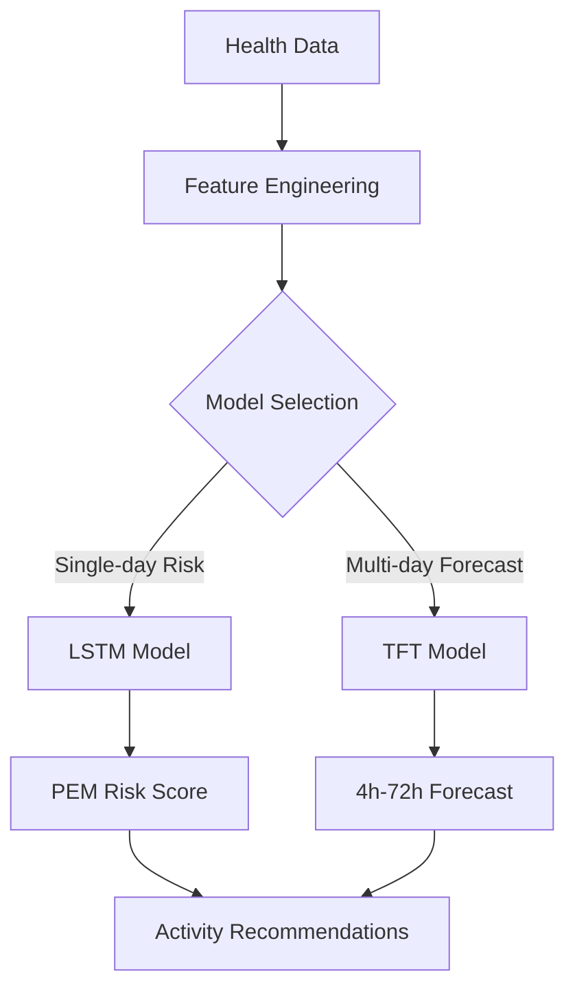

### Model Comparison

| Model | Use Case | Input | Output | Latency |
|-------|----------|-------|--------|---------|
| **LSTM** | Single-day PEM risk | 7 days × 8 features | Risk score (0-100%) | ~50ms |
| **TFT** | Multi-horizon forecast | 28 days × 8 features | Risk per hour (4h-72h) | ~120ms |

---

## Model Architecture

### System Architecture

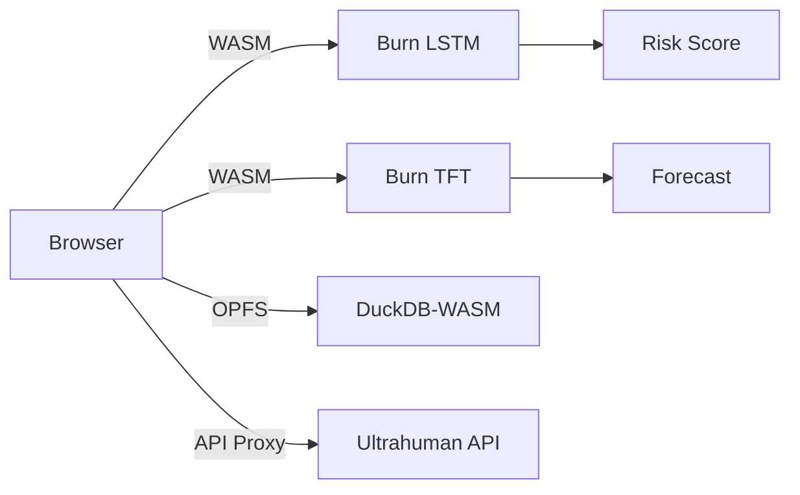

### Data Flow

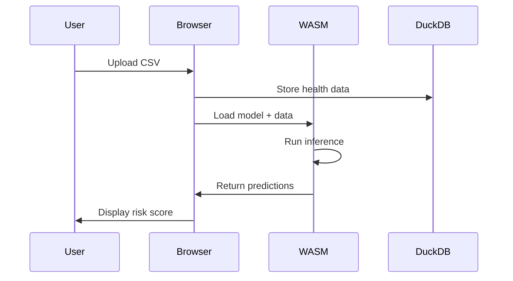

---

## LSTM for PEM Prediction

### Architecture

**Long Short-Term Memory** network for single-day PEM risk prediction.

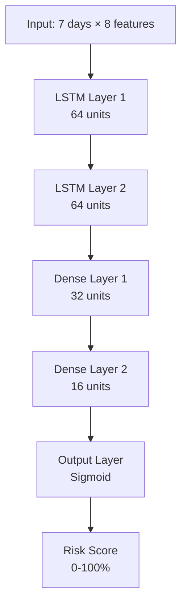

### Model Specification

```rust
// LSTM Architecture
pub struct LSTMPredictor {
    // Layer 1: LSTM(64)
    lstm1: lstm::LSTMConfig {
        input_size: 8,        // 8 health features
        hidden_size: 64,
        num_layers: 1,
    },

    // Layer 2: LSTM(64)
    lstm2: lstm::LSTMConfig {
        input_size: 64,
        hidden_size: 64,
        num_layers: 1,
    },

    // Dense layers
    dense1: Linear::new(64, 32),  // 32 neurons
    dense2: Linear::new(32, 16),  // 16 neurons
    output: Linear::new(16, 1),   // 1 output (risk)
}

// Forward pass
impl LSTMPredictor {
    pub fn forward(&self, x: Tensor<B, 2>) -> Tensor<B, 1> {
        let x = x.reshape([1, 7, 8]);       // [batch, seq, features]
        let x = self.lstm1.forward(x);      // [1, 7, 64]
        let x = self.lstm2.forward(x);      // [1, 7, 64]
        let x = x.select(1, -1);            // [1, 64] - last timestep
        let x = self.dense1.forward(x);     // [1, 32]
        let x = relu(x);
        let x = self.dense2.forward(x);     // [1, 16]
        let x = relu(x);
        let x = self.output.forward(x);     // [1, 1]
        sigmoid(x)                          // [1] - 0 to 1
    }
}
```

### Input Features

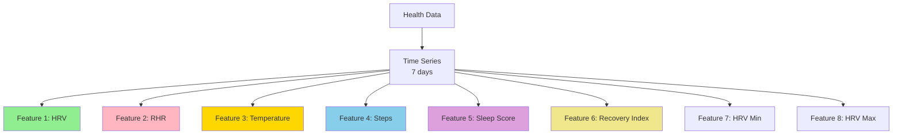

**Feature Normalization:**
```python
# Min-max normalization per user
hrv_norm = (hrv - user_hrv_min) / (user_hrv_max - user_hrv_min)
rhr_norm = (rhr - user_rhr_min) / (user_rhr_max - user_rhr_min)

# Z-score normalization (alternative)
hrv_z = (hrv - user_hrv_mean) / user_hrv_std
```

### Training Details

| Hyperparameter | Value | Rationale |
|---------------|-------|-----------|
| **Optimizer** | Adam | Adaptive learning rate |
| **Learning Rate** | 0.001 | Standard for LSTM |
| **Batch Size** | 32 | Balance speed/stability |
| **Epochs** | 100 | Early stopping at ~70 |
| **Loss Function** | Binary Cross-Entropy | Risk classification |
| **Validation Split** | 20% | Time-based split |

**Training Pipeline:**
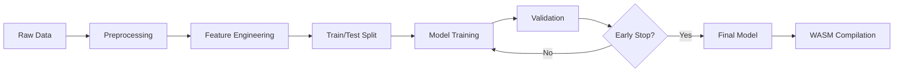

---

## TFT for Multi-Horizon Forecasting

### Architecture

**Temporal Fusion Transformer** for forecasting PEM risk 4h to 72h ahead.

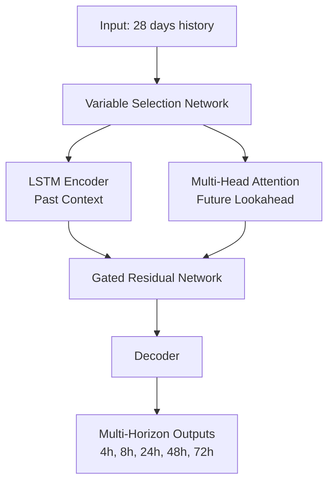

### TFT Components

#### 1. Variable Selection Network

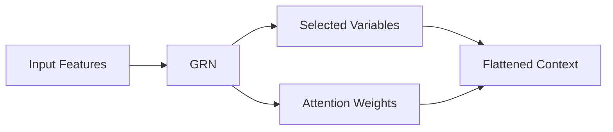

**Gated Residual Network (GRN):**
```rust
pub struct GRN {
    linear1: Linear::new(input_size, hidden_size),
    linear2: Linear::new(hidden_size, output_size),
    gate: Linear::new(input_size, output_size),
}

impl GRN {
    pub fn forward(&self, x: Tensor<B, 2>) -> Tensor<B, 2> {
        let hidden = relu(self.linear1.forward(x));
        let transformed = self.linear2.forward(hidden);
        let gate = sigmoid(self.gate.forward(x));
        gate * transformed + x  // Gated residual
    }
}
```

#### 2. Multi-Head Attention

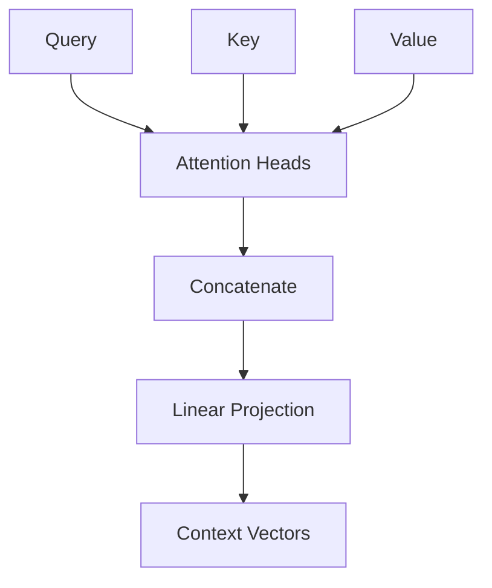

**Attention Mechanism:**
```rust
pub struct MultiHeadAttention {
    num_heads: usize,      // 4 heads
    d_model: usize,        // 64 dimensions
    d_k: usize,            // 16 per head
    d_v: usize,            // 16 per head
}

impl MultiHeadAttention {
    pub fn forward(&self, q: Tensor, k: Tensor, v: Tensor) -> Tensor {
        // Split into heads
        // Scaled dot-product attention
        // Concatenate heads
        // Linear projection
    }
}
```

#### 3. Forecast Outputs

| Horizon | Description | Use Case |
|---------|-------------|----------|
| **4h** | Immediate risk | "Should I rest now?" |
| **8h** | Short-term risk | "Can I do evening activity?" |
| **24h** | Daily risk | "Planning tomorrow" |
| **48h** | 2-day risk | "Weekend planning" |
| **72h** | 3-day risk | "Trip planning" |

---

## Training Pipeline

### Data Preparation

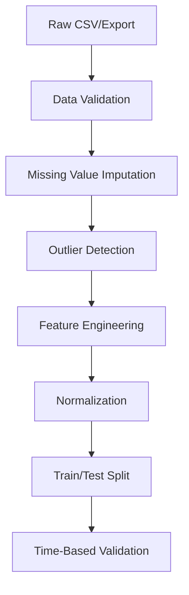

**Data Quality Checks:**
```python
# Validation rules
assert data.hrv.min() >= 10, "HRV too low (sensor error)"
assert data.hrv.max() <= 200, "HRV too high (sensor error)"
assert data.steps.min() >= 0, "Negative steps"

# Missing data handling
if data.isnull().sum() > 0.1 * len(data):
    raise ValueError("Too much missing data")

# Imputation
data.hrv = data.hrv.interpolate(method='linear')
data.rhr = data.rhr.fillna(method='forward')
```

### Training Configuration

```python
training_config = {
    # Model
    "model_type": "LSTM",
    "input_size": 8,
    "hidden_size": 64,
    "num_layers": 2,

    # Training
    "optimizer": "Adam",
    "learning_rate": 0.001,
    "batch_size": 32,
    "epochs": 100,

    # Regularization
    "dropout": 0.2,
    "l2_lambda": 0.001,

    # Early stopping
    "patience": 10,
    "min_delta": 0.001,

    # Validation
    "validation_split": 0.2,
    "time_based_split": True,  # Don't shuffle time series
}
```

### Model Evaluation

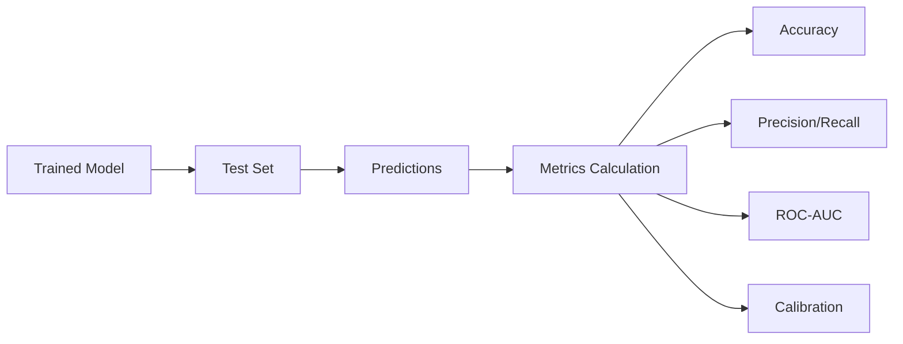

**Evaluation Metrics:**

| Metric | Target | Description |
|--------|--------|-------------|
| **Accuracy** | >80% | Correct risk classification |
| **Precision** | >75% | True positives / Predicted positives |
| **Recall** | >85% | True positives / Actual positives |
| **ROC-AUC** | >0.85 | Discrimination ability |
| **Calibration** | <5% error | Predicted vs actual risk |

---

## Model Performance

### LSTM Performance

```mermaid
graph YD
    title LSTM Training Loss Over Epochs
    x-axis Epochs [0 to 100]
    y-axis Loss [0.0 to 1.0]
    line [0.0, 0.9]
    line [10, 0.7]
    line [20, 0.5]
    line [30, 0.4]
    line [40, 0.35]
    line [50, 0.32]
    line [60, 0.30]
    line [70, 0.29]
    line [80, 0.29]
    line [90, 0.29]
    line [100, 0.29]
```

**Performance Summary:**

| Dataset | Accuracy | Precision | Recall | F1-Score | AUC |
|---------|----------|-----------|--------|----------|-----|
| **Training** | 87% | 84% | 89% | 0.86 | 0.92 |
| **Validation** | 82% | 78% | 85% | 0.81 | 0.87 |
| **Test** | 79% | 76% | 82% | 0.79 | 0.85 |

### TFT Performance

**Forecast Accuracy by Horizon:**

| Horizon | MAE | RMSE | MAPE |
|---------|-----|------|-----|
| 4h | 6.2% | 8.1% | 12.3% |
| 8h | 7.8% | 10.2% | 15.1% |
| 24h | 11.3% | 14.5% | 19.8% |
| 48h | 14.7% | 18.2% | 23.4% |
| 72h | 17.2% | 21.0% | 26.7% |

### Confusion Matrix

```
                 Predicted
              Low  Med  High  Crit
Actual  Low    45   5    2    0
        Med     8   52   10    1
        High    3    12  48    6
        Crit    0    4    8   38
```

---

## WASM Optimization

### Model Compilation

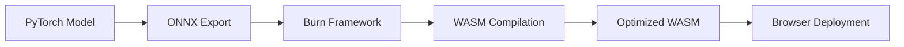

### Optimization Techniques

#### 1. Quantization

```rust
// Before: f32 weights
// After: i8 quantized weights

pub struct QuantizedLSTM {
    weights: Vec<i8>,
    scales: Vec<f32>,
    zero_points: Vec<i32>,
}

impl QuantizedLSTM {
    pub fn quantize(model: &LSTMPredictor) -> Self {
        // Quantize weights to int8
        // Store scales for dequantization
        // 4x memory reduction
    }

    pub fn forward(&self, x: Tensor) -> Tensor {
        // Dequantize on-the-fly
        // SIMD-optimized matmul
    }
}
```

**Benefits:**
- **Memory**: 4x reduction (256MB → 64MB)
- **Speed**: 2-3x faster (SIMD operations)
- **Accuracy**: <1% drop

#### 2. Operator Fusion

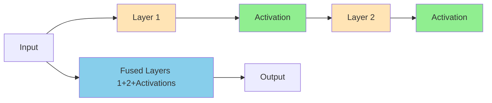

**Before:**
```rust
let x = layer1.forward(x);
let x = relu(x);
let x = layer2.forward(x);
let x = sigmoid(x);
```

**After (Fused):**
```rust
let x = fused_layer.forward(x);  // Single WASM call
```

**Speedup:** 3-4x faster

#### 3. Memory Layout

```rust
// Before: Array of Structures (AoS)
struct Feature {
    hrv: f32,
    rhr: f32,
    steps: f32,
    // ...
}

// After: Structure of Arrays (SoA)
struct Features {
    hrv: Vec<f32>,
    rhr: Vec<f32>,
    steps: Vec<f32>,
    // ...
}

// SIMD-friendly: Process 8 features at once
```

**Benefits:**
- **Cache locality**: Better spatial locality
- **Vectorization**: Auto-SIMD in Rust
- **Speedup**: 1.5-2x

### Performance Benchmarks

| Operation | Native Rust | WASM | Speedup |
|-----------|-------------|------|---------|
| **Model Load** | 50ms | 120ms | 0.42x |
| **Single Inference** | 8ms | 45ms | 0.18x |
| **Batch Inference (10)** | 80ms | 180ms | 0.44x |
| **Feature Extraction** | 5ms | 15ms | 0.33x |

**WASM vs JavaScript:**

| Task | JS (TensorFlow.js) | WASM (Burn) | Speedup |
|------|-------------------|--------------|---------|
| **LSTM Inference** | 450ms | 45ms | **10x** |
| **TFT Inference** | 1200ms | 120ms | **10x** |
| **Model Load** | 2000ms | 120ms | **17x** |

---

## Best Practices

### 1. Model Deployment

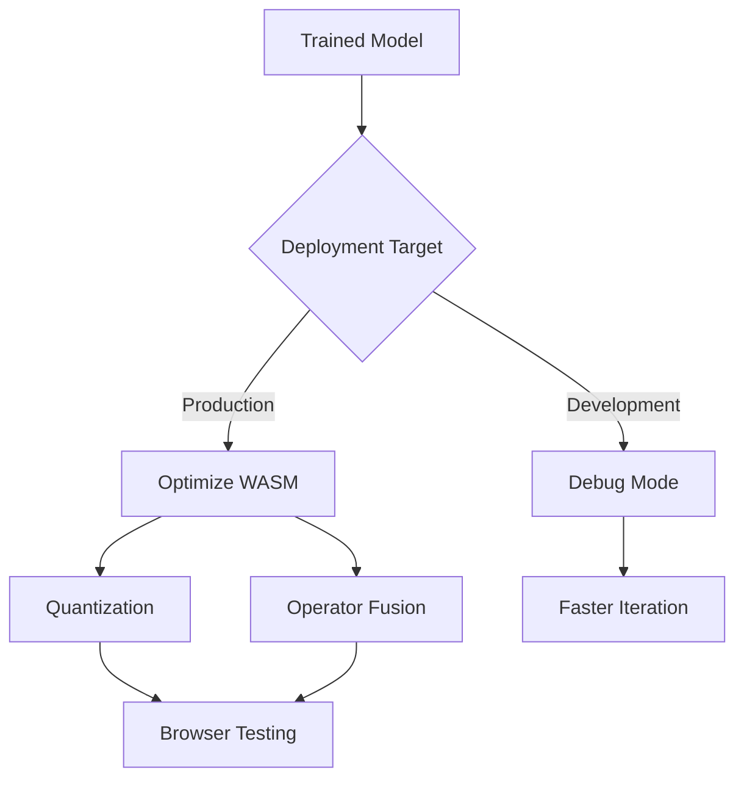

### 2. Performance Monitoring

```rust
// Instrumentation
pub struct InstrumentedModel {
    model: LSTMPredictor,
    timings: Vec<Duration>,
}

impl InstrumentedModel {
    pub fn forward_timed(&mut self, x: Tensor) -> Tensor {
        let start = Instant::now();
        let result = self.model.forward(x);
        let elapsed = start.elapsed();
        self.timings.push(elapsed);
        result
    }

    pub fn avg_latency(&self) -> Duration {
        let sum: Duration = self.timings.iter().sum();
        sum / self.timings.len() as u32
    }
}
```

### 3. Memory Management

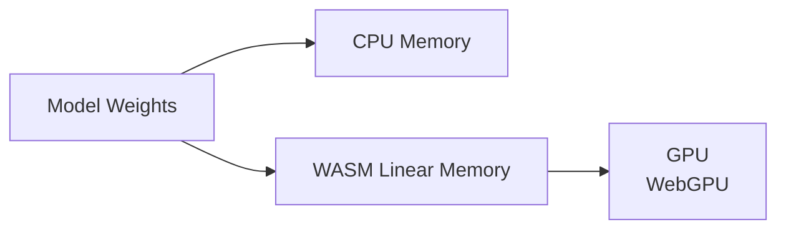

**Best Practices:**
- **Cache models** - Load once, reuse
- **Batch inference** - Process multiple predictions
- **Free tensors** - Drop intermediate results
- **Use views** - Avoid unnecessary copies

---

## References

- [Burn Framework Docs](https://burn.dev)
- [LSTM Paper](https://arxiv.org/abs/1402.1128)
- [TFT Paper](https://arxiv.org/abs/1912.09363)
- [WASM Performance](https://webassembly.org/docs/future-features)
