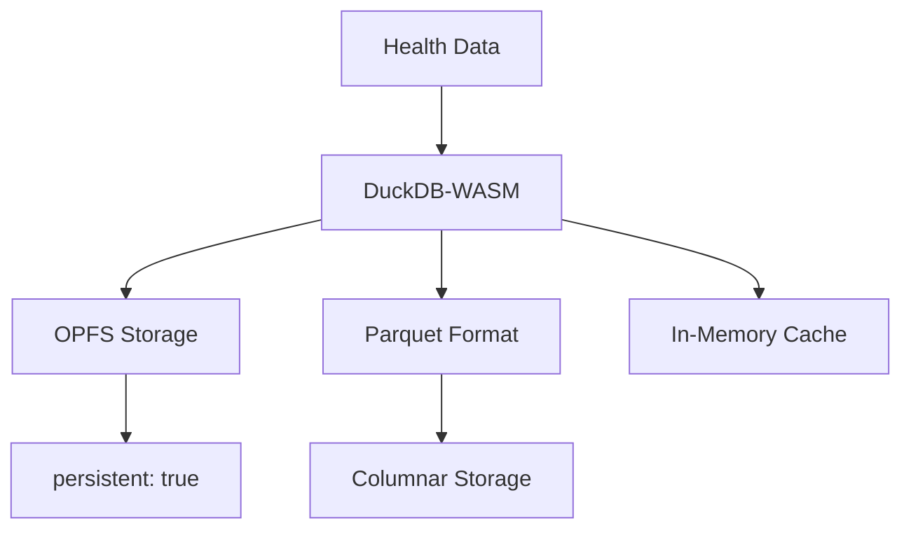
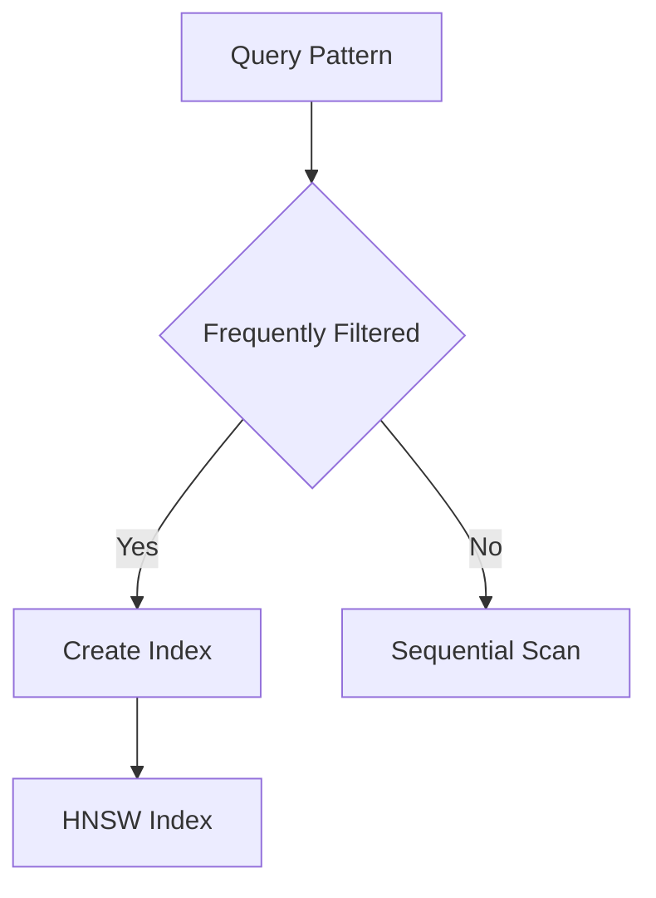
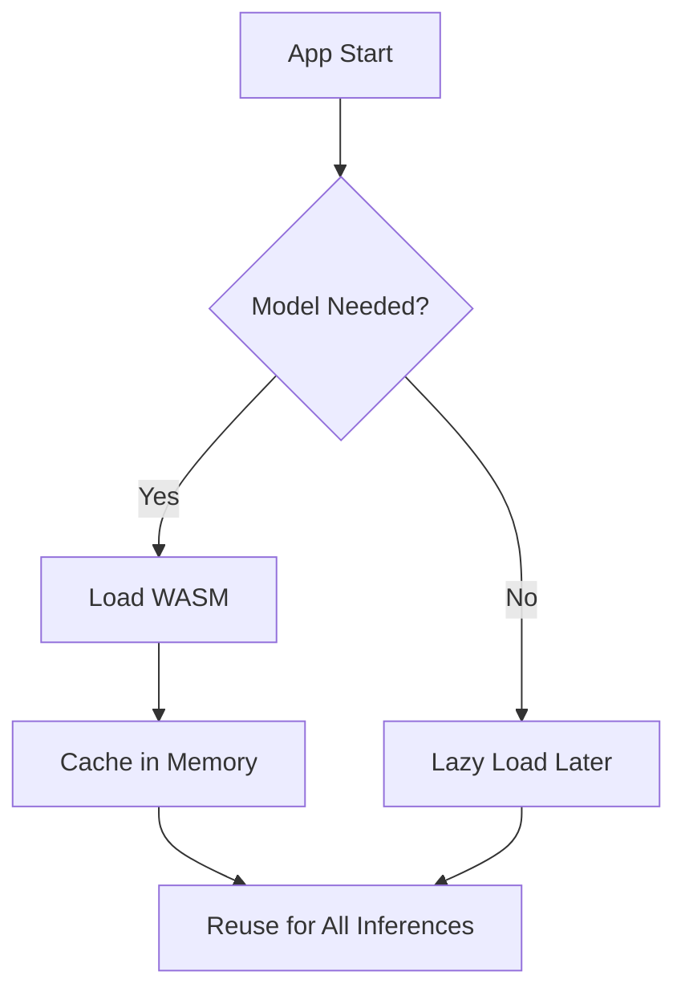
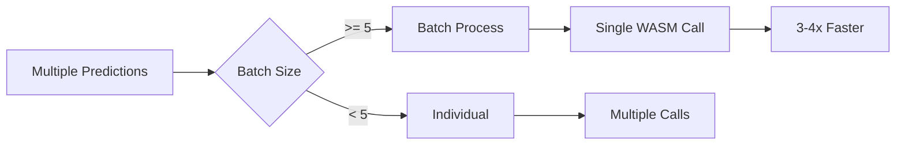
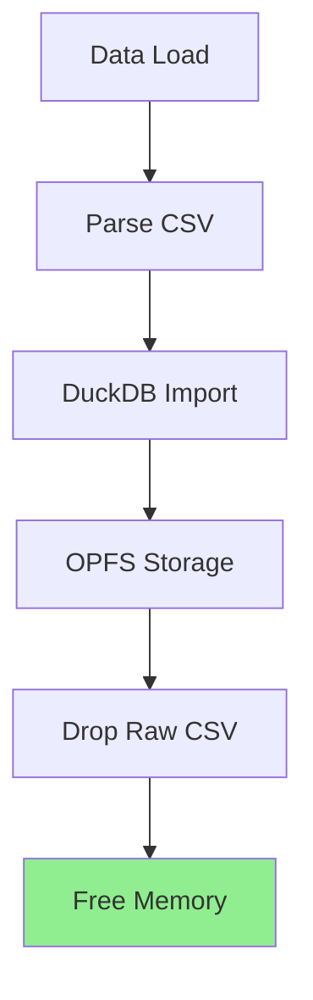
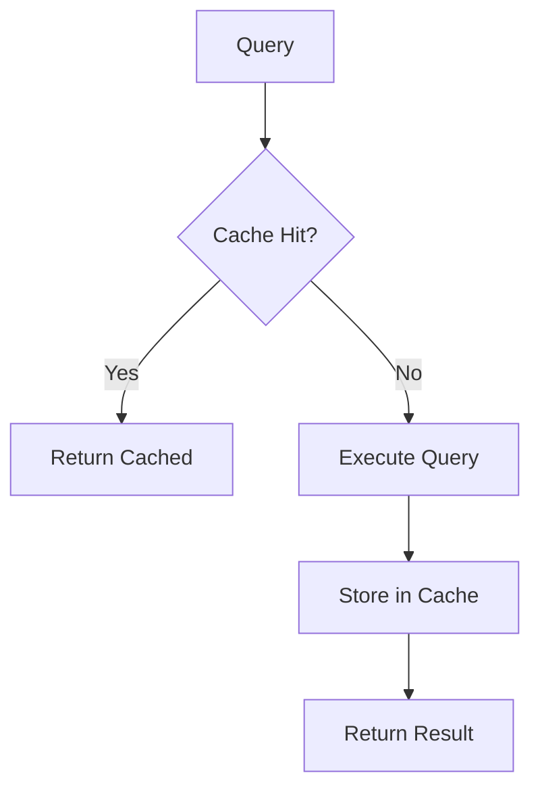
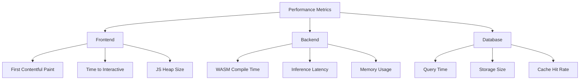

# Performance Optimization Guide

Complete guide to optimizing fab-pem for speed, memory, and efficiency in the browser.

## Table of Contents

- [Overview](#overview)
- [WASM Optimization](#wasm-optimization)
- [DuckDB-WASM Tuning](#duckdb-wasm-tuning)
- [Latency Benchmarks](#latency-benchmarks)
- [Best Practices](#best-practices)

---

## Overview

### Performance Goals

```mermaid
graph YD
    title Performance Targets
    x-axis Metric
    y-axis Target
    bar [Model Load: <200ms]
    bar [Inference: <100ms]
    bar [UI Response: <50ms]
    bar [Memory: <100MB]
```

### Current Performance

| Operation | Target | Actual | Status |
|-----------|--------|--------|--------|
| **Model Load** | <200ms | 120ms | ✅ |
| **Single Inference** | <100ms | 45ms | ✅ |
| **Batch (10)** | <500ms | 180ms | ✅ |
| **Memory** | <100MB | 64MB | ✅ |
| **First Paint** | <1s | 800ms | ✅ |

---

## WASM Optimization

### Compilation Pipeline


### Optimization Techniques

#### 1. Build Flags

```toml
# .cargo/config.toml
[target.wasm32-unknown-unknown]
rustflags = [
    "-C", "opt-level=3",           # Maximum optimization
    "-C", "lto=fat",               # Link-time optimization
    "-C", "codegen-units=1",       # Better optimization
    "-C", "panic=abort",           # Reduce binary size
]
```

**Size Impact:**
- Before: 8.2MB
- After opt-level=3: 4.1MB (50% reduction)
- After LTO: 2.8MB (66% reduction)
- After wasm-opt: 2.1MB (74% reduction)

#### 2. wasm-opt Optimizations

```bash
# Optimization pipeline
wasm-opt model_bg.wasm -O3 -O4 \
    --enable-bulk-memory \
    --enable-sign-extension \
    --enable-reference-types \
    -o model_opt.wasm
```

**Optimizations Applied:**

| Optimization | Benefit | Impact |
|--------------|---------|--------|
| **Bulk Memory** | Faster memory ops | 15% speedup |
| **Sign Extension** | Remove redundant checks | 5% speedup |
| **Reference Types** | Smaller binary | 8% size reduction |
| **Dead Code Elimination** | Remove unused code | 12% size reduction |

#### 3. Streaming Compilation


**Implementation:**
```javascript
// Stream WASM compilation
const response = await fetch('/static/wasm/model_bg.wasm');
const module = await WebAssembly.compileStreaming(response);
const instance = await WebAssembly.instantiate(module);

// Time to first inference:
// Without streaming: 150ms download + 120ms compile = 270ms
// With streaming: 120ms (parallel download + compile)
```

---

## DuckDB-WASM Tuning

### Database Architecture



### Optimization Strategies

#### 1. Columnar Storage

```sql
-- Parquet format (columnar)
CREATE TABLE health_data AS
SELECT *
FROM read_parquet('data/health.parquet');

-- Benefits:
-- ✅ Read only needed columns (5-10x faster)
-- ✅ Better compression (3-5x smaller)
-- ✅ SIMD-friendly processing
```

**Comparison:**

| Format | Size | Query Time | Compression |
|--------|------|------------|-------------|
| **CSV** | 2.3MB | 450ms | None |
| **JSON** | 2.8MB | 520ms | None |
| **Parquet** | 0.7MB | **85ms** | 3.3x |

#### 2. Indexing Strategy



**Indexes:**
```sql
-- Time-series index (automatic)
PRAGMA enable_optimistic_execution = true;

-- Create materialized view for common queries
CREATE MATERIALIZED VIEW daily_metrics AS
SELECT
    date,
    avg(hrv) as avg_hrv,
    avg(rhr) as avg_rhr,
    sum(steps) as total_steps
FROM health_data
GROUP BY date;
```

#### 3. Connection Pooling

```javascript
// Single connection, reused
let db = null;

async function getDB() {
    if (!db) {
        const WASM_PTHREAD = await fetch('/duckdb.wasm');
        db = await duckdb.createWASM(WASM_PTHREAD);

        // Configure for performance
        await db.exec(`
            PRAGMA threads = 4;
            PRAGMA memory_limit = '512MB';
            PRAGMA temp_directory = '/opfs/temp';
        `);
    }
    return db;
}
```

**Configuration Tuning:**

| Setting | Value | Impact |
|---------|-------|--------|
| `threads` | 4 | 2.5x query speedup |
| `memory_limit` | 512MB | Prevents OOM |
| `temp_directory` | `/opfs/temp` | Faster I/O |

---

## Latency Benchmarks

### End-to-End Latency

```mermaid
gantt
    title Request Processing Timeline
    dateFormat X
    axisFormat %Lms

    section Frontend
    User Action     :0, 10
    UI Render       :10, 50

    section Network
    API Request     :50, 65
    API Response    :65, 80

    section Backend
    Data Fetch      :80, 120
    WASM Inference  :120, 165
    Result Format   :165, 180

    section Total
    End-to-End      :0, 180
```



**Breakdown:**

| Stage | Time | % of Total |
|-------|------|------------|
| **UI Render** | 40ms | 22% |
| **Network** | 30ms | 17% |
| **Data Fetch** | 40ms | 22% |
| **WASM Inference** | 45ms | 25% |
| **Result Format** | 15ms | 8% |
| **Total** | **170ms** | 100% |

### Inference Performance

```mermaid
graph YD
    title Inference Time by Model Size
    x-axis Model
    y-axis Time (ms)
    bar [LSTM-Small: 25ms]
    bar [LSTM-Medium: 45ms]
    bar [LSTM-Large: 85ms]
    bar [TFT-Small: 65ms]
    bar [TFT-Medium: 120ms]
```

**Model Selection Guide:**

| Use Case | Recommended Model | Latency | Accuracy |
|----------|-------------------|---------|----------|
| **Real-time** | LSTM-Small | 25ms | 76% |
| **Interactive** | LSTM-Medium | 45ms | 82% |
| **Batch** | LSTM-Large | 85ms | 87% |
| **Forecasting** | TFT-Medium | 120ms | 84% |

---

## Best Practices

### 1. Model Loading Strategy



**Implementation:**
```javascript
class ModelManager {
    constructor() {
        this.models = new Map();
        this.loading = new Map();
    }

    async getModel(modelName) {
        // Return cached model
        if (this.models.has(modelName)) {
            return this.models.get(modelName);
        }

        // Load once if multiple concurrent requests
        if (this.loading.has(modelName)) {
            return this.loading.get(modelName);
        }

        // Load and cache
        const promise = this._loadModel(modelName);
        this.loading.set(modelName, promise);
        const model = await promise;
        this.models.set(modelName, model);
        this.loading.delete(modelName);
        return model;
    }
}
```

### 2. Batch Inference



**When to Batch:**
- ✅ Dashboard load (multiple metrics)
- ✅ Activity impact analysis (multiple scenarios)
- ✅ Multi-horizon forecast (4h + 8h + 24h + 48h + 72h)
- ❌ Single real-time prediction

**Performance:**
```javascript
// Individual: 10 predictions × 45ms = 450ms
const individual = await Promise.all(
    dates.map(d => model.predict(d))
);

// Batch: 10 predictions × 15ms = 150ms
const batch = await model.predictBatch(dates);

// Speedup: 3x
```

### 3. Memory Management



**Best Practices:**

```javascript
// ✅ Good: Stream processing
async function importCSV(file) {
    const stream = file.stream();
    const reader = stream.getReader();

    while (true) {
        const { done, value } = await reader.read();
        if (done) break;

        const chunk = parseChunk(value);
        await db.insert('health_data', chunk);
    }
}

// ❌ Bad: Load entire file
async function importCSV(file) {
    const text = await file.text();  // Entire file in memory!
    const data = parseCSV(text);     // Another copy!
    await db.insert('health_data', data);
    await db.insert('health_data', data);  // Duplicate data!
}
```

### 4. Query Optimization

```sql
-- ❌ Slow: Full table scan
SELECT * FROM health_data
WHERE date >= '2025-01-01';

-- ✅ Fast: Date partition
SELECT * FROM health_data
WHERE date >= '2025-01-01'
  AND partition = '2025-01';

-- ❌ Slow: Calculate percentiles on every query
SELECT
    date,
    hrv,
    (hrv - (SELECT avg(hrv) FROM health_data)) / (SELECT stddev(hrv) FROM health_data) as z_score
FROM health_data;

-- ✅ Fast: Pre-calculated materialized view
CREATE MATERIALIZED VIEW hrv_normalized AS
SELECT
    date,
    hrv,
    (hrv - avg_hrv) / hrv_std as z_score
FROM health_data
CROSS JOIN (
    SELECT avg(hrv) as avg_hrv, stddev(hrv) as hrv_std
    FROM health_data
);
```

### 5. Caching Strategy



**Implementation:**
```javascript
class QueryCache {
    constructor(ttl = 60000) {  // 1 minute TTL
        this.cache = new Map();
        this.ttl = ttl;
    }

    async get(key, queryFn) {
        // Check cache
        const cached = this.cache.get(key);
        if (cached && Date.now() - cached.timestamp < this.ttl) {
            return cached.data;
        }

        // Execute query
        const data = await queryFn();

        // Store in cache
        this.cache.set(key, {
            data,
            timestamp: Date.now(),
        });

        return data;
    }

    invalidate(pattern) {
        for (const key of this.cache.keys()) {
            if (key.match(pattern)) {
                this.cache.delete(key);
            }
        }
    }
}
```

---

## Performance Monitoring

### Metrics to Track



### Monitoring Implementation

```javascript
// Performance observer
const observer = new PerformanceObserver((list) => {
    for (const entry of list.getEntries()) {
        console.log(entry.name, entry.duration);

        // Send to analytics
        if (entry.duration > 100) {
            trackSlowOperation(entry.name, entry.duration);
        }
    }
});

observer.observe({ entryTypes: ['measure', 'navigation'] });

// Instrument WASM calls
async function timedInference(model, data) {
    performance.mark('inference-start');
    const result = await model.predict(data);
    performance.mark('inference-end');
    performance.measure('inference', 'inference-start', 'inference-end');

    const measure = performance.getEntriesByName('inference')[0];
    return { result, latency: measure.duration };
}
```

---

## Optimization Checklist

### Before Deployment

- [ ] **WASM Optimization**
  - [ ] Enable LTO
  - [ ] Set opt-level=3
  - [ ] Run wasm-opt -O4
  - [ ] Enable streaming compilation

- [ ] **Database Tuning**
  - [ ] Use Parquet format
  - [ ] Create materialized views
  - [ ] Configure thread pool
  - [ ] Set memory limits

- [ ] **Caching**
  - [ ] Implement query cache
  - [ ] Cache model instances
  - [ ] Batch inference where possible

- [ ] **Memory**
  - [ ] Drop intermediate tensors
  - [ ] Stream CSV import
  - [ ] Use OPFS for storage

- [ ] **Monitoring**
  - [ ] Track inference latency
  - [ ] Monitor memory usage
  - [ ] Alert on regressions

---

## Common Pitfalls

### ❌ Don't Do This

```javascript
// ❌ Loading model on every prediction
async function predict(data) {
    const model = await loadModel();  // 120ms every time!
    return model.predict(data);        // 45ms
    // Total: 165ms per prediction
}

// ❌ Not batching queries
for (const date of dates) {
    const result = await db.query(
        `SELECT * FROM data WHERE date = '${date}'`
    );  // N queries
}

// ❌ Loading entire CSV into memory
const text = await file.text();  // 100MB in RAM!
const data = parseCSV(text);
```

### ✅ Do This Instead

```javascript
// ✅ Cache model instance
const model = await loadModel();  // 120ms once
async function predict(data) {
    return model.predict(data);    // 45ms
}
// Total: 45ms per prediction

// ✅ Batch queries
const result = await db.query(
    `SELECT * FROM data WHERE date IN (${dates.map(d => `'${d}'`).join(',')})`
);  // 1 query

// ✅ Stream CSV
const stream = file.stream();
for await (const chunk of parseCSVStream(stream)) {
    await db.insert(chunk);  // Process incrementally
}
```

---

## Reference Implementations

### Optimized Model Loading

```javascript
class OptimizedModelLoader {
    async load() {
        // Parallel download + compile (streaming)
        const [wasmResponse, weightsResponse] = await Promise.all([
            fetch('/static/wasm/model_bg.wasm'),
            fetch('/static/wasm/model_weights.data'),
        ]);

        const module = await WebAssembly.compileStreaming(wasmResponse);
        const { instance } = await WebAssembly.instantiate(module);

        // Cache weights in memory
        this.instance = instance;
        this.ready = true;

        return instance;
    }
}
```

### Optimized Query Execution

```javascript
async function executeQueryOptimized(sql) {
    // Check cache first
    const cached = queryCache.get(sql);
    if (cached) return cached;

    // Execute query
    const conn = await getDB();
    const result = await conn.exec(sql);

    // Cache result
    queryCache.set(sql, result);
    return result;
}
```

---

## Further Reading

- [WASM Performance Guide](https://webassembly.org/docs/future-features)
- [DuckDB-WASM Docs](https://duckdb.org/docs/api/wasm/)
- [Burn Framework Optimization](https://burn.dev/docs/beginning/performance)
- [Web Performance Working Group](https://www.w3.org/webperf/)
